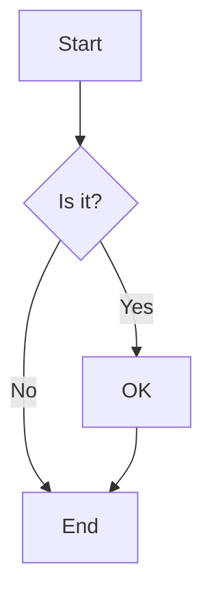

```json vega
{
  "$schema": "https://vega.github.io/schema/vega/v5.json",
  "description": "This is the central brain of the page",
  "signals": [
    {
      "name": "jsonTable",
      "update": "data('jsonTable')"
    },
    {
      "name": "networkTable",
      "update": "data('networkTable')"
    },
    {
      "name": "flowchartOutput",
      "value": ""
    },
    {
      "name": "networkOutput",
      "value": ""
    },
    {
      "name": "jsonData",
      "update": "data('jsonData')"
    },
    {
      "name": "networkData",
      "update": "data('networkData')"
    }
  ],
  "data": [
    {
      "name": "networkData",
      "values": [
        {
          "lineTemplate": "subgraph",
          "name": "Production"
        },
        {
          "lineTemplate": "server",
          "id": "web1",
          "name": "Web Server",
          "ip": "10.0.1.10"
        },
        {
          "lineTemplate": "server",
          "id": "db1",
          "name": "Database",
          "ip": "10.0.1.20"
        },
        {
          "lineTemplate": "end"
        },
        {
          "lineTemplate": "subgraph",
          "name": "Development"
        },
        {
          "lineTemplate": "server",
          "id": "dev1",
          "name": "Dev Server",
          "ip": "10.0.2.10"
        },
        {
          "lineTemplate": "end"
        },
        {
          "lineTemplate": "secureConnection",
          "from": "web1",
          "to": "db1"
        },
        {
          "lineTemplate": "connection",
          "from": "dev1",
          "to": "web1"
        }
      ]
    },
    {
      "name": "jsonData",
      "values": [
        {
          "lineTemplate": "node",
          "id": "A",
          "label": "Start"
        },
        {
          "lineTemplate": "node",
          "id": "B",
          "label": "Middle"
        },
        {
          "lineTemplate": "node",
          "id": "C",
          "label": "End"
        },
        {
          "lineTemplate": "labeledEdge",
          "from": "A",
          "to": "B",
          "label": "Next"
        },
        {
          "lineTemplate": "edge",
          "from": "B",
          "to": "C"
        }
      ]
    },
    {
      "name": "networkTable",
      "values": []
    },
    {
      "name": "jsonTable",
      "values": []
    }
  ]
}
```


# Mermaid Plugin Examples
This page demonstrates the mermaid plugin in Chartifact, including raw text, data-driven, and dynamic modes.

## Raw Text Mode
Simple flowchart using raw mermaid syntax:





## Data-Driven Mode
Template-based diagram generation:


```yaml tabulator
dataSourceName: jsonData
tabulatorOptions:
  columns:
    - title: LineTemplate
      field: lineTemplate
      editor: list
      editorParams:
        values:
          - node
          - edge
          - labeledEdge
    - title: ID
      field: id
      editor: input
    - title: Label
      field: label
      editor: input
    - title: From
      field: from
      editor: input
    - title: To
      field: to
      editor: input
    - title: Text
      field: text
      editor: input
  layout: fitColumns
  maxHeight: 150px
editable: true
variableId: jsonTable
```


```yaml mermaid
template:
  dataSourceName: jsonTable
  header: flowchart TD
  lineTemplates:
    node: '{{id}}[{{label}}]'
    edge: '{{from}} --> {{to}}'
    labeledEdge: '{{from}} -->|{{label}}| {{to}}'
variableId: flowchartOutput
```


### Generated Mermaid Source:
```
{{flowchartOutput}}
```

## More Complex Example
Network diagram with servers and connections:


```yaml tabulator
dataSourceName: networkData
tabulatorOptions:
  columns:
    - title: LineTemplate
      field: lineTemplate
      editor: list
      editorParams:
        values:
          - server
          - connection
          - secureConnection
          - subgraph
          - end
    - title: ID
      field: id
      editor: input
    - title: Name
      field: name
      editor: input
    - title: IP
      field: ip
      editor: input
    - title: From
      field: from
      editor: input
    - title: To
      field: to
      editor: input
  layout: fitColumns
  maxHeight: 200px
editable: true
variableId: networkTable
```


```yaml mermaid
template:
  dataSourceName: networkTable
  header: graph LR
  lineTemplates:
    server: '{{id}}[{{name}}<br/>{{ip}}]'
    connection: '{{from}} --- {{to}}'
    secureConnection: '{{from}} -.->|SSL| {{to}}'
    subgraph: subgraph {{name}}
    end: end
variableId: networkOutput
```


### Generated Network Diagram Source:


```yaml textbox
variableId: networkOutput
value: ''
multiline: true
```


## String Input Mode
This example shows how to consume the generated Mermaid text from above and render it directly:


```yaml mermaid
variableId: networkOutput
```


This demonstrates the flexible input capability - the same `dataSourceName` property can handle string or array input.