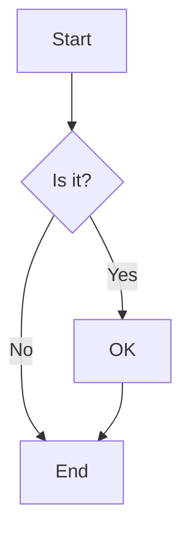

```json vega
{
  "$schema": "https://vega.github.io/schema/vega/v5.json",
  "description": "This is the central brain of the page",
  "signals": [
    {
      "name": "jsonTable",
      "update": "data('jsonTable')"
    },
    {
      "name": "jsonData",
      "update": "data('jsonData')"
    },
    {
      "name": "networkTable",
      "update": "data('networkTable')"
    },
    {
      "name": "networkData",
      "update": "data('networkData')"
    },
    {
      "name": "flowchartOutput",
      "update": "flowchartOutput"
    },
    {
      "name": "networkOutput",
      "update": "networkOutput"
    }
  ],
  "data": [
    {
      "name": "jsonData",
      "values": [
        { "template": "header", "diagram": "flowchart TD" },
        { "template": "node", "id": "A", "label": "Start" },
        { "template": "node", "id": "B", "label": "Middle" },
        { "template": "node", "id": "C", "label": "End" },
        { "template": "labeledEdge", "from": "A", "to": "B", "label": "Next" },
        { "template": "edge", "from": "B", "to": "C" },
        { "template": "comment", "text": "This is a sample diagram" }
      ]
    },
    {
      "name": "jsonTable",
      "values": []
    },
    {
      "name": "networkData",
      "values": [
        { "template": "header", "diagram": "graph LR" },
        { "template": "subgraph", "name": "Production" },
        { "template": "server", "id": "web1", "name": "Web Server", "ip": "10.0.1.10" },
        { "template": "server", "id": "db1", "name": "Database", "ip": "10.0.1.20" },
        { "template": "end" },
        { "template": "subgraph", "name": "Development" },
        { "template": "server", "id": "dev1", "name": "Dev Server", "ip": "10.0.2.10" },
        { "template": "end" },
        { "template": "secureConnection", "from": "web1", "to": "db1" },
        { "template": "connection", "from": "dev1", "to": "web1" }
      ]
    },
    {
      "name": "networkTable",
      "values": []
    }
  ]
}
```

## JSON Data

Load data from a static JSON array.

```json tabulator
{
  "dataSourceName": "jsonData",
  "variableId": "jsonTable",
  "editable": true,
  "tabulatorOptions": {
    "columns": [
      {"title": "Template", "field": "template", "editor": "list", "editorParams": {"values": ["header", "node", "edge", "labeledEdge", "comment"]}},
      {"title": "Diagram", "field": "diagram", "editor": "input"},
      {"title": "ID", "field": "id", "editor": "input"},
      {"title": "Label", "field": "label", "editor": "input"},
      {"title": "From", "field": "from", "editor": "input"},
      {"title": "To", "field": "to", "editor": "input"},
      {"title": "Text", "field": "text", "editor": "input"}
    ],
    "layout": "fitColumns",
    "maxHeight": "150px"
  }
}
```

# Mermaid Plugin Examples

## Raw Text Mode

Simple flowchart using raw mermaid syntax:



## Data-Driven Mode

Template-based diagram generation:

```mermaid
{
  "dataSourceName": "jsonTable",
  "variableId": "flowchartOutput",
  "lineTemplates": {
    "header": "{{diagram}}",
    "node": "{{id}}[{{label}}]",
    "edge": "{{from}} --> {{to}}",
    "labeledEdge": "{{from}} -->|{{label}}| {{to}}",
    "comment": "%% {{text}}"
  }
}
```

### Generated Mermaid Source:
```
{{flowchartOutput}}
```

The above template would work with data like:

```json
[
  { "template": "header", "diagram": "flowchart TD" },
  { "template": "node", "id": "A", "label": "Start" },
  { "template": "node", "id": "B", "label": "Middle" },
  { "template": "node", "id": "C", "label": "End" },
  { "template": "labeledEdge", "from": "A", "to": "B", "label": "Next" },
  { "template": "edge", "from": "B", "to": "C" },
  { "template": "comment", "text": "This is a sample diagram" }
]
```

Which would generate:

```
flowchart TD
A[Start]
B[Middle]
C[End]
A -->|Next| B
B --> C
%% This is a sample diagram
```

## More Complex Example

Network diagram with servers and connections:

```json tabulator
{
  "dataSourceName": "networkData",
  "variableId": "networkTable",
  "editable": true,
  "tabulatorOptions": {
    "columns": [
      {"title": "Template", "field": "template", "editor": "list", "editorParams": {"values": ["header", "server", "connection", "secureConnection", "subgraph", "end"]}},
      {"title": "Diagram", "field": "diagram", "editor": "input"},
      {"title": "ID", "field": "id", "editor": "input"},
      {"title": "Name", "field": "name", "editor": "input"},
      {"title": "IP", "field": "ip", "editor": "input"},
      {"title": "From", "field": "from", "editor": "input"},
      {"title": "To", "field": "to", "editor": "input"}
    ],
    "layout": "fitColumns",
    "maxHeight": "200px"
  }
}
```

```mermaid
{
  "dataSourceName": "networkTable",
  "variableId": "networkOutput",
  "lineTemplates": {
    "header": "{{diagram}}",
    "server": "{{id}}[{{name}}<br/>{{ip}}]",
    "connection": "{{from}} --- {{to}}",
    "secureConnection": "{{from}} -.->|SSL| {{to}}",
    "subgraph": "subgraph {{name}}",
    "end": "end"
  }
}
```

### Generated Network Diagram Source:
```json textbox
{
    "variableId": "networkOutput",
    "multiline": true
}
```

## String Input Mode

This example shows how to consume the generated Mermaid text from above and render it directly:

```mermaid
{
  "dataSourceName": "networkOutput",
  "variableId": "renderedFromString"
}
```

This demonstrates the flexible input capability - the same `dataSourceName` property can handle:
- String input (like from the textbox above)
- Array input (like from the tabulator examples)

The plugin automatically detects the input type and renders accordingly.
