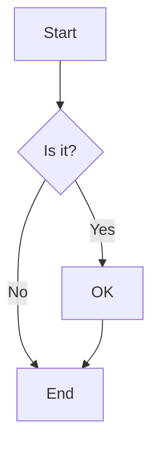

```json vega
{
  "$schema": "https://vega.github.io/schema/vega/v5.json",
  "description": "This is the central brain of the page",
  "signals": [
    {
      "name": "jsonTable",
      "update": "data('jsonTable')"
    },
    {
      "name": "jsonData",
      "update": "data('jsonData')"
    }
  ],
  "data": [
    {
      "name": "jsonData",
      "values": [
  { "template": "columns", "id": "", "label": "", "from": "", "to": "" },
  { "template": "node", "id": "A", "label": "Start" },
  { "template": "node", "id": "B", "label": "Middle" },
  { "template": "node", "id": "C", "label": "End" },
  { "template": "labeledEdge", "from": "A", "to": "B", "label": "Next" },
  { "template": "edge", "from": "B", "to": "C" },
  { "template": "comment", "text": "This is a sample diagram" }
]
    },
    {
      "name": "jsonTable",
      "values": []
    }
  ]
}
```

## JSON Data

Load data from a static JSON array.

```json tabulator
{
  "dataSourceName": "jsonData",
  "variableId": "jsonTable",
"editable": true,
  "tabulatorOptions": {
    "autoColumns": true,
    "layout": "fitColumns",
    "maxHeight": "100px"
  }
}
```

# Mermaid Plugin Examples

## Raw Text Mode

Simple flowchart using raw mermaid syntax:



## Data-Driven Mode

Template-based diagram generation:

```mermaid
{
  "diagramType": "flowchart TD",
  "dataSourceName": "jsonTable",
  "lineTemplates": {
    "node": "{{id}}[{{label}}]",
    "edge": "{{from}} --> {{to}}",
    "labeledEdge": "{{from}} -->|{{label}}| {{to}}",
    "comment": "%% {{text}}"
  }
}
```

The above template would work with data like:

```json
[
  { "template": "node", "id": "A", "label": "Start" },
  { "template": "node", "id": "B", "label": "Middle" },
  { "template": "node", "id": "C", "label": "End" },
  { "template": "labeledEdge", "from": "A", "to": "B", "label": "Next" },
  { "template": "edge", "from": "B", "to": "C" },
  { "template": "comment", "text": "This is a sample diagram" }
]
```

Which would generate:

```
flowchart TD
A[Start]
B[Middle]
C[End]
A -->|Next| B
B --> C
%% This is a sample diagram
```

## More Complex Example

```mermaid
{
  "diagramType": "graph LR",
  "dataSourceName": "networkData", 
  "lineTemplates": {
    "server": "{{id}}[{{name}}<br/>{{ip}}]",
    "connection": "{{from}} --- {{to}}",
    "secureConnection": "{{from}} -.->|SSL| {{to}}",
    "subgraph": "subgraph {{name}}",
    "end": "end"
  }
}
```
